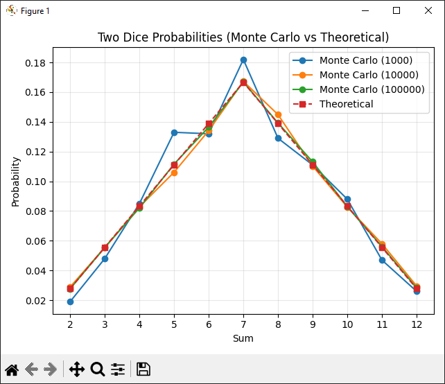

# Task 7: Monte Carlo Simulation of Two Dice Rolls

## Results:

```
Trials: 1000  
Sum | Count     | Monte Carlo | Theoretical | Difference  
--------------------------------------------------------  
  2 |        27 |      0.0270 |      0.0278 |     0.0008
  3 |        72 |      0.0720 |      0.0556 |     0.0164
  4 |        73 |      0.0730 |      0.0833 |     0.0103
  5 |       109 |      0.1090 |      0.1111 |     0.0021
  6 |       143 |      0.1430 |      0.1389 |     0.0041
  7 |       145 |      0.1450 |      0.1667 |     0.0217
  8 |       133 |      0.1330 |      0.1389 |     0.0059
  9 |       113 |      0.1130 |      0.1111 |     0.0019
 10 |        92 |      0.0920 |      0.0833 |     0.0087
 11 |        62 |      0.0620 |      0.0556 |     0.0064
 12 |        31 |      0.0310 |      0.0278 |     0.0032
```

```
Trials: 10000
Sum | Count     | Monte Carlo | Theoretical | Difference
---------------------------------------------------------
  2 |       261 |      0.0261 |      0.0278 |     0.0017
  3 |       560 |      0.0560 |      0.0556 |     0.0004
  4 |       821 |      0.0821 |      0.0833 |     0.0012
  5 |      1074 |      0.1074 |      0.1111 |     0.0037
  6 |      1395 |      0.1395 |      0.1389 |     0.0006
  7 |      1722 |      0.1722 |      0.1667 |     0.0055
  8 |      1353 |      0.1353 |      0.1389 |     0.0036
  9 |      1073 |      0.1073 |      0.1111 |     0.0038
 10 |       907 |      0.0907 |      0.0833 |     0.0074
 11 |       552 |      0.0552 |      0.0556 |     0.0004
 12 |       282 |      0.0282 |      0.0278 |     0.0004
```

```
Trials: 100000
Sum | Count     | Monte Carlo | Theoretical | Difference
---------------------------------------------------------
  2 |      2880 |      0.0288 |      0.0278 |     0.0010
  3 |      5535 |      0.0554 |      0.0556 |     0.0002
  4 |      8498 |      0.0850 |      0.0833 |     0.0016
  5 |     11229 |      0.1123 |      0.1111 |     0.0012
  6 |     13850 |      0.1385 |      0.1389 |     0.0004
  7 |     16540 |      0.1654 |      0.1667 |     0.0013
  8 |     13808 |      0.1381 |      0.1389 |     0.0008
  9 |     11100 |      0.1110 |      0.1111 |     0.0001
 10 |      8308 |      0.0831 |      0.0833 |     0.0003
 11 |      5498 |      0.0550 |      0.0556 |     0.0006
 12 |      2754 |      0.0275 |      0.0278 |     0.0002
 ```

 

## Conclusion:

The Monte Carlo simulation results converge to the theoretical probabilities as the number of trials increases.  
For 100,000 trials, the differences between simulated and theoretical probabilities are minimal, which confirms the correctness of the implementation.  
The highest probability is observed for the sum 7, while the lowest probabilities correspond to sums 2 and 12, fully matching the theoretical distribution.